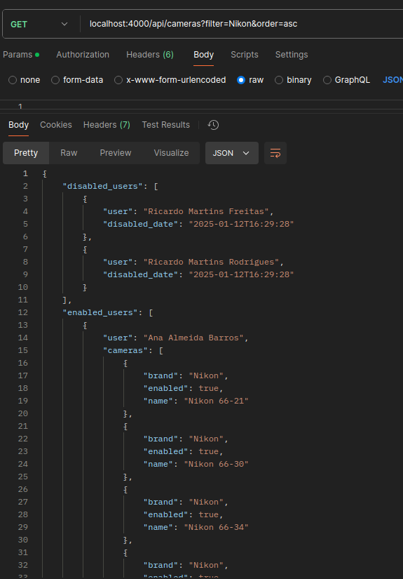
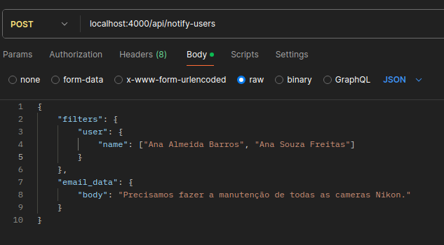
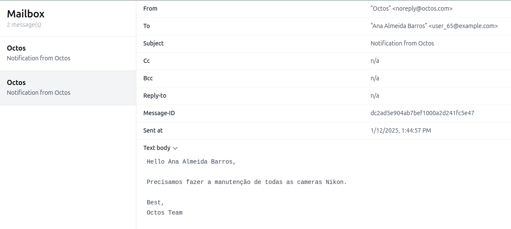

# Exercício de Backend - Octos

Projeto referente à etapa de exercício de código do processo de contratação da Octos.


<details>
<summary>Enunciado</summary>


Nesse exercício, pedimos para criar uma aplicação Phoenix e implementar algumas funcionalidades nela. A aplicação Phoenix é uma API

Geralmente, nós encorajamos os candidatos a fazerem premissas e resolverem do jeito que acharem melhor, desde que essas premisssas e abordagens sejam eplixadas e documentadas. No entanto, se você tiver mais questão, não hesite em nos contactar por email ou whatsapp.

O app não precisa ter nada de HTML, então você pode criar um app com `--no-html` `--no-assets`. Além disso, pense como um programador frontend iria integrar com essa API e como tornar isso fácil.

Observação: nós usamos GraphQL, mas faça com o que tiver mais conhecimento.

### Expectativas

- Deve ser código pronto para produção
  - O código nos mostrará como você entrega coisas para produção e será um reflexo do seu trabalho.
  - Apenas para ser bem claro: Não esperamos que você realmente o implante em algum lugar ou faça um release. Esta é uma declaração sobre a qualidade da solução.
- Você tem 5 dias para entregar o código. Além disso, se houver algo que você teve que deixar incompleto ou se há uma melhor solução que você implementaria, mas não pôde devido a limitações de tempo pessoais, por favor, tente nos guiar através do seu processo de pensamento ou de quaisquer partes faltantes, utilizando a seção "Detalhes da Implementação" abaixo.

### O que você vai construir

Um aplicativo Phoenix com 2 endpoints para gerenciar câmeras.

Não esperamos que você implemente autenticação e autorização, mas sua solução final deve assumir que será implantada em produção e que os dados serão consumidos por uma Single Page Application que roda nos navegadores dos clientes.

### Requisitos

- Devemos armazenar usuários e câmeras em um banco de dados PostgreSQL.
- Cada usuário tem um nome e pode ter múltiplas câmeras.
- Cada câmeras deve ter uma marca.
- Todos os campos acima definidos devem ser obrigatórios.
- Cada usuário deve ter pelo menos 1 câmera ativa em um dado momento.
- Todos os endpoints devem retornar JSON.
- Um arquivo readme com instruções sobre como executar o aplicativo.

#### Semeando o banco de dados

- mix ecto.setup deve criar tabelas no banco de dados e preenchê-lo com 1 mil usuários; para cada usuário, devem ser criadas 50 câmeras com nomes/marcas aleatórias.
- O status de cada câmera também deve ser aleatório, permitindo usuários com apenas 1 câmera ativa e usuários com mútiplas câmeras ativas.
- Deve-se usar 4 ou mais marcas diferentes, sendo ao menos estas: Intelbras, Hikvision, Giga e Vivotek.
- O nome dos usuários pode ser aleatório.
- Suponha que os engenheiros precisem semear seus bancos de dados regularmente, então o desempenho do script de seed é importante.

#### Tarefas

1. Implementar um endpoint para fornecer uma lista de usuários e suas câmeras
   - Cada usuário deve retornar seu nome e suas câmeras ativas.
   - Alguns usuários podem ter sido desligados (a funcionalidade de desligamento deve ser considerada fora do escopo deste exercício), então só nesse caso é possível que todas as câmeras pertencentes a um usuário estejam inativas. Nestes casos, o endpoint deve retornar a data em que o usuário foi desligado.
   - Este endpoint deve suportar filtragem por parte do nome da câmera e ordenação pelo nome da camera.
   - Endpoint: GET /cameras

2. Implementar um endpoint que envia um e-mail para cada usuário com uma câmera da marca Hikvision;
   - ⚠️ O app não precisa enviar email de fato, então você não precisa necessariamente de acesso à internet para trabalhar no seu desafio.
   - Você pode usar o modo "dev/mailbox" que já vem no phoenix.
   - Endpoint: POST /notify-users

</details>

---


## Instruções de execução:
Este projeto está dockerizado para garantir compatibilidade em qualquer ambiente. Siga os passos abaixo para executar o sistema:

1. ***Subir container***

   No diretório do projeto, execute:  
   ```bash
   docker compose up
   ```  

   O servidor estará disponível em `http://localhost:4000`.

2. **Acessar o shell do container**  

   No diretório do projeto, execute:  
   ```bash
   docker compose run --rm octos
   ```

3. **Executar testes e lint**  

   Entre no shell do container:  
   ```bash
   docker compose run --rm octos sh
   ```

   Execute os testes no shell:  
   ```bash
   MIX_ENV=test mix test
   ```

   Execute o lint no shell:  
   ```bash
   mix credo --strict
   ```

4. **Listar câmeras ativas dos usuários**

   Faça uma requisição `GET` para `http://localhost:4000/api/cameras` com os seguintes parâmetros opcionais:

   `filter`: Filtro para o nome das câmeras,

   `order`: Ordenação pelo nome das câmeras (`asc` ou `desc`).

   ```
   http://localhost:4000/api/cameras?filter=valor1&order=asc

   ```

   ### Exemplo
   <details>
   <summary>Expandir</summary>
   
   </details>


5. **Enviar e-mail para usuários**

   Faça uma requisição `POST` para `http://localhost:4000/api/notify-users` com um corpo JSON no formato:  
   ```json
   {
      "filters": {
         "user": {
            "name": ["Dr. Henry Wu"],
            "email": []
         },
         "camera": {
            "name": ["Camera 1", "Camera 2"],
            "brand": ["Hikvision"]
         }
      },
      "email_data": {
         "subject": "Notification from Octos",
         "body": "Email Body"
      }
   }
   ```

   **Observações:**

   - Os parâmetros `filters` e `email_data` são opcionais.  
   - Se o `body` estiver vazio, o e-mail não será enviado (trava de segurança).  
   - E-mails simulados podem ser visualizados em: `http://localhost:4000/dev/mailbox`.

   ### Exemplo
   <details>
   <summary>Expandir</summary>
   
   
   </details>

---

## Detalhes da Implementação

### População do Banco (Seeds)
- Usuários ativos e inativos foram criados para possibilitar testes variados.  
- As câmeras são geradas com combinações de marca e ID do usuário, otimizando filtros e visualização.  
- Para criar 1000 usuários, utilizei combinações de nomes reais.  
- Uma coluna `password` foi adicionada pensando em uma futura funcionalidade de login. Todas as estruturas foram desenhadas com escalabilidade em mente.

### Consultar Câmeras Ativas
- **Local:** `lib/octos/services/cameras/queries.ex`  
- **Função:** `fetch_users_cameras(params \ %{})`  

Decisões de implementação:
- A query foi construída como string para adicionar filtros e ordenação de maneira clara e evitar erros de variáveis não vinculadas (`unbound`).
- Os filtros e ordenações foram aplicados diretamente na query para aproveitar as otimizações do banco de dados e reduzir o tráfego de rede.
- A resposta inclui usuários ativos com suas câmeras e inativos com a data de desativação. Considerei que atualizações em usuários inativos só são permitidas para reativação. Portanto, a data de desativação deve ser igual ao updated_at (última atualização é a de desativação).
- Adicionei como atributos de módulo o campo a ser filtrado/ordenado para facilitar uma possíevel mudança posterior. Mas fica como ideia de melhoramento colocar essa informação como parâmetro na request.

### Enviar Notificação por E-mail
- **Consulta de usuários:**  
  - Local: `lib/octos/services/users/queries.ex`  
  - Função: `fetch_users_by(filters)`  

- **Serviço de e-mail:**  
  - Local: `lib/octos/services/email.ex`  
  - Função: `send_email_to_user(user, email_data)`  

Decisões de implementação:
- Filtros e dados de e-mail foram parametrizados para facilitar futuras extensões.  
- Caso o assunto (`subject`) não seja informado, um texto padrão será usado.  
- Caso o corpo (`body`) não seja informado, o e-mail não será enviado. Se for informado, o texto será formatado colocando a introdução e saudação final.

### Testes
- Foram adicionados testes para todas as funções criadas, mesmo as fora do escopo direto deste exercício.  
- Testes unitários foram isolados com mocks de dependências externas para validar corretamente o comportamento interno do código.
